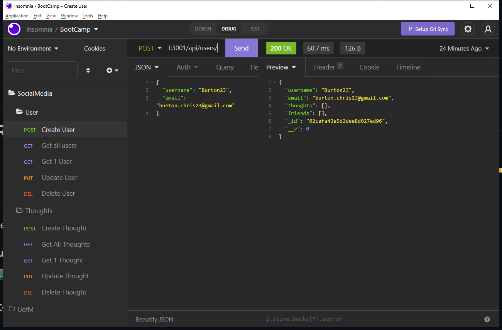

  # Social Media Startup
  

  
  
  ## Description
  this is the backend setup for a new social meadia site in development.

  ### Tools and Languages used
  
   ##### Frontend:

##### Backend:

##### Database:  
 

#### Dependencies:

  

  ## Screenshots
  

  

  ## Links
  GitHub Repository: https://github.com/wizzle13/socialmedia-startup

  Walkthrough Video: https://drive.google.com/file/d/1l0CFVcPTZrRRsHdX9yCHmqna8Bjvj7nz/view?usp=sharing

  &copy;2020 by Chris Burton
